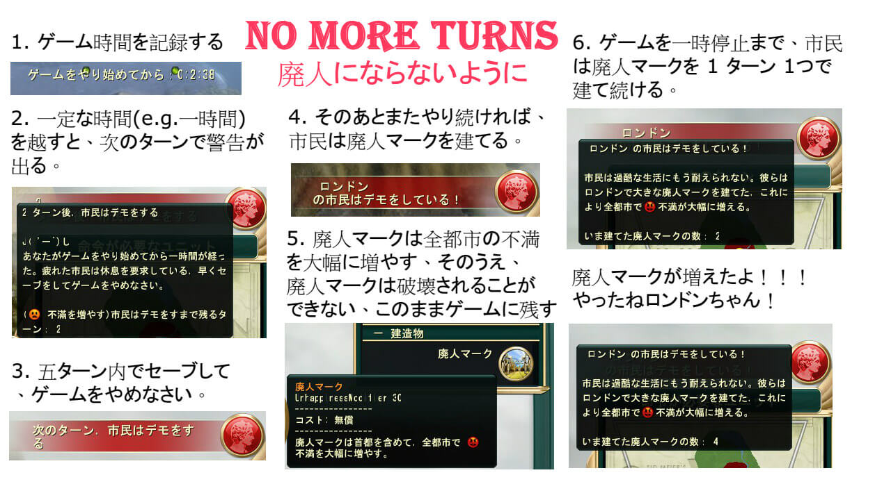

# civ5mod-no-more-turns

## What does this Mod do

Please see [the Mod's page on Steam Workshop](http://steamcommunity.com/sharedfiles/filedetails/?id=531108994)

## Todo

- Before publishing, remeber to disable debug mode.
- The player should be able to tweak two options in the OptionsMenu.
  - A. (Slider) How many minutes is allowed in a single game session. (default is 60)
  - B. (Slider) After A. is reached, how many turns are left before the citizens start to protest. (default is 5)
- Add icon for `Protest Sign`. (Currently we are using the [Ikanda](http://civilization.wikia.com/wiki/Ikanda_(Civ5)) icon.)
- Are there better ways to implement unhappiness modifier?
- Change descriptions to not make false sense.

## Credit

Special thanks to:

- [The Newbie’s Guide to Modding Civilization 5](http://forums.civfanatics.com/showthread.php?t=493900) by LuvToBuild @ [civfanatics](http://forums.civfanatics.com/) for all the reference links.
- [Modders Guide to Civilization V](http://forums.civfanatics.com/showthread.php?t=385009) by Kael @ [civfanatics](http://forums.civfanatics.com/) for everything.
- [XML data files for Standard Civilizations (inc DLC)](http://forums.civfanatics.com/showthread.php?t=490901) for Buildings/Units XML files.
- [how to add free happiness to a player by lua event](http://forums.civfanatics.com/showthread.php?t=429585) for the trick of using building to modify happiness.

## License

This project is licensed under the terms of the [Do What The Fuck You Want To Public License (WTFPL)](http://www.wtfpl.net/about/).
